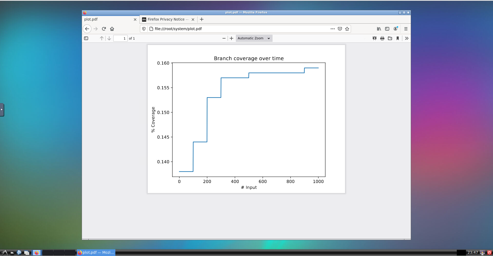
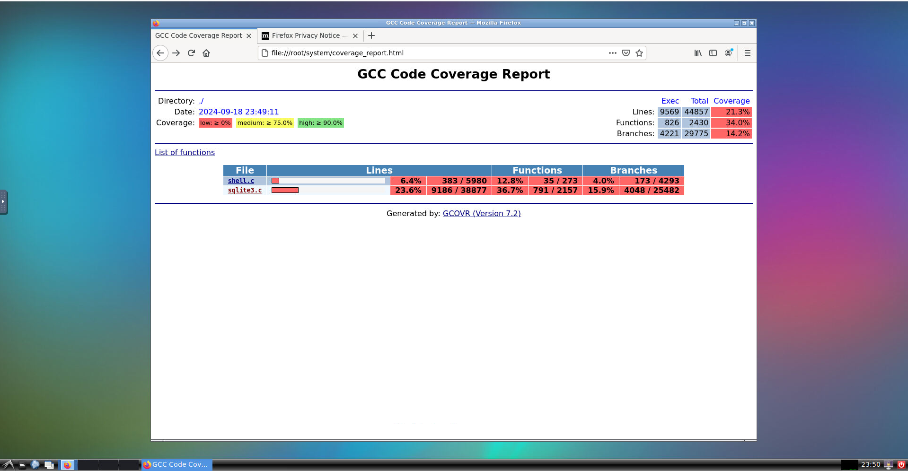

# SWEN90006 Assignment 2: Fuzzing SQLite

## Acknowledgement

This assignment is based on [an interactive exercise](https://jzamudio.com/sql-grammar-based-fuzzer/), presented to the audience at [the Fuzzing and Software Security Summer School](https://fuzzing.comp.nus.edu.sg/), and on [the Fuzzing Book](https://www.fuzzingbook.org/).

## Overview

[SQLite](https://sqlite.org/) is a lightweight, serverless database engine that provides a self-contained, file-based solution for storing and managing data with minimal setup. SQLite is arguably (and surprisingly?) the most widely used database engine, with billions of instances across various platforms. It is integrated into nearly every Android and iOS device, as well as most Mac and Windows 10 systems, and is present in major web browsers like Firefox, Chrome, and Safari. Additionally, SQLite is used in numerous applications and devices, including Skype, iTunes, Dropbox, TurboTax, QuickBooks, television sets, automotive systems, and many others. To learn more about how SQLite works, please watch this [introductory video](https://youtu.be/jH39c5-y6kg).

This assignment involves the security testing of SQLite using mutation-based, generation-based, and coverage-guided fuzzing (covered in Chapter 8 and Chapter 9 of the lecture notes). The goal of this assignment is to systematically fuzz test SQLite to achieve high code coverage and discover security vulnerabilities.

## Folder structure

This repository has the following structure

```
assignment-2
├── Dockerfile-Intel: Dockerfile for host computers with Intel CPUs
├── Dockerfile-Arm64: Dockerfile for host computers with Arm CPUs (e.g., Apple M1/M2/M3)
├── system: contains the system under test (SQLite), all the fuzzers, and running script (run_experiment.py)
│      └── grammar_fuzzer.py: a grammar-based fuzzer from the Fuzzing Book
│      └── grammar.py: to be updated by each group
│      └── mutation_fuzzer.py: a mutation-based fuzzer from the Fuzzing Book
│      └── run_experiment.py: script to run experiments 
│      └── seed-corpus: contains seed inputs for mutation-based fuzzing
│          └── seed1.dat: a sample seed input
│      └── *.c, *.h: source code of SQLite
│      └── Makefile: provides configurations to compile SQLite and do other things (e.g., folder cleaning)
└── results: contains bug-triggering inputs and other artifacts
└── group_info.txt: to be filled by each group
└── GroupAgreement.docx: to be filled by each group
└── README.md
└── images: images used in the README
```

## Setting up the fuzzing environment

### Building and running the program

This assignment uses Docker to simplify the setup. To build a "ready-to-fuzz" Docker image, you just need to run the `docker build` command. Specifically, the following command will build a Docker image named `swen90006-assignment2`. Note that we provide two versions of the Dockerfile: one for Intel CPUs and one for Arm64 CPUs (e.g., Apple chips).

If your host computer is powered by an Intel chip, use this command in your terminal.

```bash
docker build . -t swen90006-assignment2 -f Dockerfile-Intel
```

or use this if your computer has an Arm64 chip

```bash
docker build . -t swen90006-assignment2 -f Dockerfile-Arm64
```

Once the Docker image is successfully built, you can start a Docker container (i.e., a virtual machine). If the container starts properly, you should see a new container named `assignment2-container` by running the `docker ps` command.

```bash
docker run -d --name assignment2-container -p 6080:80 swen90006-assignment2
```

The above command starts a container in the detached mode and you can access it by running the following command.

```
docker exec -it assignment2-container /bin/bash
```

If this command is successful, it should display a prompt like `root@7b838ad2db0d:/root/system#`, indicating the Docker ID, the active user account, and that you are in the `/root/system` folder where the SQLite code and all fuzzers are stored.

You can now test your fuzzing setup by running the following command to fuzz SQLite using the provided grammar-based fuzzer and a simple grammar (stored in `grammar.py`). 

Please note, for Arm64 CPUs, your keyword for python is **python3**, for Intel CPUs, your keyword for Python is **Python3.10**. All examples below only show exemplar commands on Arm CPUs. 

```
python3 run_experiment.py --fuzzer_type grammar_based --plot-every-x 100 --runs 1000
```

Once fuzzing is complete, the script will generate a plot showing the code coverage improvement over time, stored in `plot.pdf`. You can copy this file to your host computer, or you can view it directly from the container by typing `localhost:6080` in your web browser, open a web browser or a PDF reader from the container, and then open the PDF file from there. You should see something like this:



This only shows the achieved code coverage over time, and you may want to investigate further to see which parts of the code have not been covered so that you can improve your fuzzing setup. To do so, you can run the following command and then open the `coverage_report.html` file.

```
make coverage-html
```

This is an example of a detailed coverage report.



## Your tasks

In this assignment, you are expected to complete the following tasks.

### Task-0: Complete group_info.txt and GroupAgreement.docx

Modify the file group_info.txt by placing your group number followed by group members' names, student IDs and email addressess. The group number should be the same as the [group number for this fuzzing assignment in the LMS](https://canvas.lms.unimelb.edu.au/courses/188994/groups#tab-27319) and student ID is the student ID number (not username). This is so we can match your repository with your group for marking.

Moreover, you will need to discuss with other members in your group and complete a group agreement document following the given template (GroupAgreement.docx).

The files must be updated and pushed to the repository by Friday Sept 27th 2024. After that time, you should not make any changes to those files.

### Task-1: Improve the SQL grammar for generation-based fuzzing

Your team is tasked with updating the input grammar for the [SQL query language](https://www.sqlite.org/lang.html), as stored in [system/grammar.py](system/grammar.py), and then running the provided [grammar fuzzer](system/grammar_fuzzer.py) to measure the code coverage achieved.

We will calculate the code coverage based on 10,000 test inputs generated by `grammar_fuzzer.py` using your grammar for marking. So you may consider using the following command to collect test results:

```
python3 run_experiment.py --fuzzer_type grammar_based --plot-every-x 100 --runs 10000
```

### Task-2: Add more mutation mutators and more seeds

The provided mutation-based fuzzer supports two modes: with and without code coverage guidance. This is a sample command to run the fuzzer without a feedback signal.

```
python3 run_experiment.py --fuzzer_type mutation_based --corpus seed-corpus --plot-every-x 100 --runs 10000
```

And this is a sample command to run the fuzzer with the code coverage guidance, in which we specify the `feedback_enabled` option.

```
python3 run_experiment.py --fuzzer_type mutation_based --feedback_enabled  --corpus seed-corpus --plot-every-x 100 --runs 10000
```

The provided seed corpus contains only one simple seed input, which consists of a few SQL queries to create a table, fill the table with some data, and select a column based on a given constraint. You need to add more seeds to this corpus to improve the fuzzer's performance.

Additionally, since the provided [mutation fuzzer](system/mutation_fuzzer.py) supports only three mutation operators, your team is tasked with designing and implementing at least three more mutation operators. For each new mutation operator, you need to measure the code coverage results and share reflections on what works and what doesn’t. The mutation operators should be substantially different from each other.

### Task-3: Vulnerability Discovery

Based on the results from Tasks 1-2, select the best approach for conducting large-scale experiments to discover vulnerabilities in SQLite. You can make any changes to the fuzzers to maximize your chances of discovering vulnerabilities. You are allowed, and even encouraged, to use other open-source fuzzers for this task if you find a good one.

The provided fuzzers do not implement the bug detector component yet. If you use them, ensure you add that feature by checking the output of SQLite. To detect more types of bugs, you can consider using sanitizers like [AddressSanitizer](https://clang.llvm.org/docs/AddressSanitizer.html) and [MemorySanitizer](https://clang.llvm.org/docs/MemorySanitizer.html), which require some updates to the [Makefile](system/Makefile).

To make this task both interesting and achievable, we provide you with an older version of SQLite (specifically version 3.31), which contains several known vulnerabilities. You are expected to automatically discover four of these vulnerabilities to receive full marks (1.5 * 4 = 6 marks) for this task, even without discovering zero-day vulnerabilities.

For a more challenging task, you can download **the latest version of SQLite** from [this page](https://www.sqlite.org/download.html), extract the files, and replace the old SQL source code in the `system` directory. If you discover zero-day vulnerabilities through fuzzing, you need to submit them to Thuan ([`thuan.pham@unimelb.edu.au`](mailto:thuan.pham@unimelb.edu.au)), including the group information, the bug-triggering input, and the instructions to reproduce it. Thuan and the teaching team will triage your submission and report the bug to the SQLite maintainers on behalf of your team. If a vulnerability is confirmed by the maintainers, the first team that discovers and submits the vulnerability to Thuan will earn 3 marks for each vulnerability. Duplicate submissions will not receive any marks. We will make the details of all bug reports submitted to the SQLite team, along with their status (confirmed or not), available at [https://github.com/swen90006-2024/assignment-2-bug-reports](https://github.com/swen90006-2024/assignment-2-bug-reports). This could help you avoid duplicate submissions and focus on discovering new vulnerabilities. It could also help manage the volume of emails sent to Thuan.

**The maintainers' confirmation cut-off time is 5 pm Friday, 25th Oct, which is one week after the assignment due date. Thuan will communicate with the maintainers on behalf of the teams, so please do not contact the maintainers directly and pressure them to confirm the bug reports.**

Note that in the context of this assignment, we only consider the following types of faults as security vulnerabilities.

1. Any fault that causes SQLite to crash or hang leading to a denial-of-service attack (e.g., Null pointer dereference ([CWE-476](https://cwe.mitre.org/data/definitions/476.html))).
2. Critical memory faults such as Stack/Heap Buffer Overflow ([CWE-121](https://cwe.mitre.org/data/definitions/121.html) and [CWE-122](https://cwe.mitre.org/data/definitions/122.html)) and Use-After-Free ([CWE-416](https://cwe.mitre.org/data/definitions/416.html)).

It means that memory leaks and "benign" integer overflows (i.e., integer overflows that do not lead to more critical issues such as program crashes) are not counted. Having said that, please discuss with us your findings and report them in your final reports if you are in any doubt.

All bugs and instructions to reproduce through fuzzing and trigger them must be submitted to the results folder and be explained in the final report (Task-4), respectively.

### Task-4: Write report & reflections

Write a group report documenting your fuzzing experiments, including: 1) your implementation in task 1-2, the rationale behind your decisions, the highest coverage reported and detailed instructions for the marker to reproduce your results; 2) description of the vulnerabilities and instructions to trigger them through fuzzing; 3) you are expected to share reflections on your experiments regarding what works well and what does not work. You can also share your opinions about the advantages and limitations of the fuzzers in use and suggest changes for improvements.

We do not provide any templates for the report and reflections, but you are expected to write a well-structured document that clearly and logically demonstrates your understanding of the topics.

### Task-5: Submit experimental artefacts

Upload all your modifications to the original code or scipt. For example, upload your best input grammar to [system/grammar.py](system/grammar.py)

Submit all other artefacts to the [results](results/) foler by following the instructions written in [results/README.md](results/README.md)

## Marking criteria

The assignment is worth 25% of your final mark. Following is the general marking criteria. The detailed marking rubric will be made available on Canvas.

| Criterion  | Description  | Highest Marks  |
|---|---|---|
| Good SQL grammar | The grammar is well-structured and complete enough to achieve good coverage. You will receive zero marks for this task if your achieved branch coverage is lower than 20%.  | 6 |
| Good seed corpus | The seed corpus is selected rationally that improves branch coverage. You will receive zero marks for this task if your achieved branch coverage with mutation-based fuzzing is lower than 25%. | 3 |
| Correctly implemented mutation operators | The mutation operators are substantially different from each other and different from the existing operators. Moreover, in the final report, you should explain your rationale behind the decision and analyze the results after adding them. | 6 |
| Vulnerabilitis discovered | 1.5 marks for each known vulnerability and 3 marks for each eligible zero-day vulnerability. The marks for this task are capped at 12, ensuring you put enough effort into the other tasks. | 6 + 6 |
| Final report & reflections | Clear demonstration of understanding of the topics used in the assignment, presented in a logical manner.  | 4 |
| **Capped Total** | | 25 |

Please note that the total marks of this assignment is capped at 25, even if some high-competent team could get higher marks due their performance in vulnerability discovery.
## Submission instructions

Some important instructions:

1. Do NOT change the main logic (e.g., control flow and data flow) of SQLite. You are allowed to add assertions to capture logic bugs thought. Please contact us if you are in any doubt.
2. Do NOT change the directory structure.

### Report submission

Your submission has two parts: 1) this repository, and 2) a PDF final report (only one group report is required). Please submit your PDF report using the link on the subject Canvas site. Go to the SWEN90006 Canvas site, select *Assignments* from the subject menu, and submit in *Assignment 2 report*.

## Tips

Some tips to managing the assignment:

1. Ensure that you understand the notes *before* diving into the assignment. Trying to learn concepts covered in Chapter 8 and Chapter 9 of the notes.

2. Ensure that you understand the weekly fuzzing examples included in this [security-testing repository](https://github.com/swen90006-2021/security-testing).

3. Ensure that you understand how the given fuzzers work before starting the assignment.
	
### Late submission policy

If you require an extension, please follow the special consideration policy or contact Thuan ([`thuan.pham@unimelb.edu.au`](mailto:thuan.pham@unimelb.edu.au)) to discuss possible options. Having assessments due for other subjects is not a valid reason for an extensive.

By default, everyone is implicitly granted an extension of up to 7 days, but with a penalty of 10% (2.5 marks) per day that the assignment is submitted late. So, if you are falling behind, you may want to consider submitted 1-2 days late if you feel you can do enough to make up the 2.5-5 marks.

If you submit late, email Thuan to let him know so he can pull the changes from the repository and deductions will be applied unless you are granted an extension.

### Academic Misconduct

The University academic integrity policy (see [https://academicintegrity.unimelb.edu.au/](https://academicintegrity.unimelb.edu.au/) applies. Students are encouraged to discuss the assignment topic, but all submitted work must represent the individual's understanding of the topic. 

The subject staff take academic misconduct very seriously. In this subject in the past, we have successfully prosecuted several students that have breached the university policy. Often this results in receiving 0 marks for the assessment, and in some cases, has resulted in failure of the subject. 

### Originality Multiplier

For work that we find is similar to another submission or information found online, an originality multiplier will be applied to the work.  For example, if 20% of the assessment is deemed to have been taken from another source, the final mark will be multiplied by 0.8.

